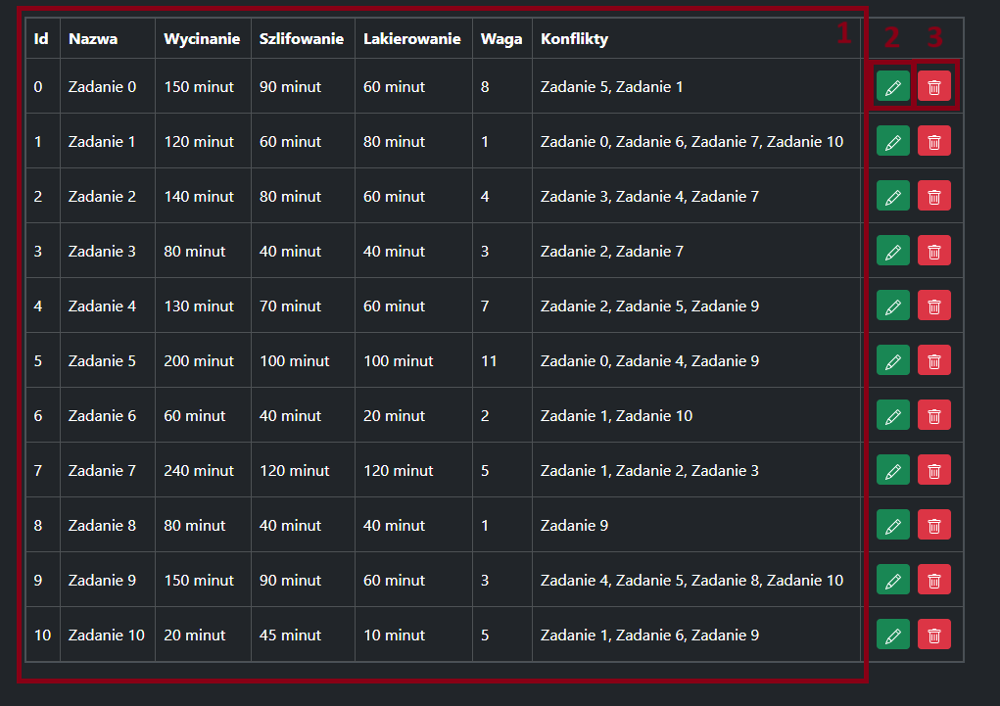
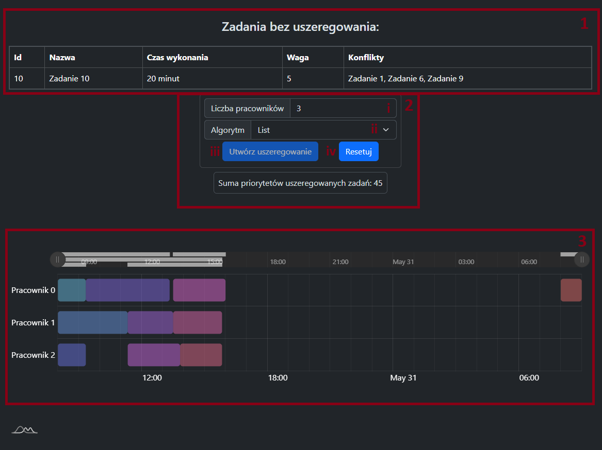
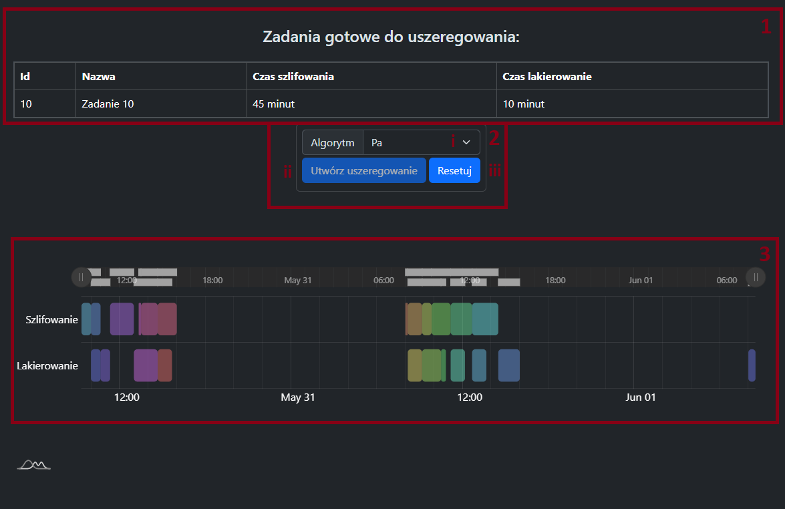

# FurniFab User Manual

# Introduction

FurniFab is a key tool for furniture manufacturers,
enabling significant improvements in various stages of production through the use of advanced software.
This technology guarantees higher quality and production efficiency,
which would be unattainable if relying solely on manual labor.
The software is specifically configured for each stage of production,
resulting in increased throughput and better work outcomes.
To achieve that result, it uses various algorithms from the literature and original.
This combination of algorithms produces results that are better than human-made results.

## Features

- **Optimizes Supply Chains**: Founds the best solution for the needed number of materials and given suppliers.
- **Better Material Efficiency**: Reduces the number of materials that are wasted in the process.
- **Improved Efficiency**: Enhances productivity at various stages of furniture production.
- **Seamless Integration**: Facilitates communication and collaboration between departments by integrating different
  production stages.

## Intended Audience

This manual is intended for planners and production managers who are responsible for the production of furniture.

# Getting Started

## System Requirements

- Windows 10 or later
- macOS 10.15 or later
- Linux Ubuntu 20.04 or later
- 4GB RAM
- 64MB Storage
- Any modern x86-64 or ARM64 processor
- Internet connection for updates

## Installation

1. Download the installer for your platform from [FurniFab](https://adiantek.github.io/FurniFab/).
   For users who are not familiar with the installation process, we recommend using the stable version.
   Snapshot channels contain the latest features and bug fixes but may be less stable and is not recommended for
   production use.
2. Run the installer and follow the instructions.
3. After installation, run the software.

## Updating

FurniFab automatically checks for updates when it is started
and will prompt you to update if a new version is available.
After the update is complete, you will be prompted to restart the software to apply the changes.

## Uninstallation

To uninstall FurniFab, follow these steps:

1. Open the control panel.
2. Find FurniFab in the list of installed programs.
3. Click on FurniFab and select `uninstall`.
4. Follow the instructions to complete the uninstallation process.

# Using FurniFab

## Overview

FurniFab is a comprehensive software suite that covers various aspects of furniture production.
It is divided into modules, each focusing on a specific stage of production.
The modules are interconnected to provide a seamless workflow from planning to production.

1. **Tasks** - This tab is used to manage furniture production tasks parameters.
2. **Supply** - This tab is used to manage suppliers and materials.
3. **Cut plan** - This tab is used to generate cutting plans for materials.
4. **Cutting** - This tab is used to schedule cutting operations.
5. **Assembly** - This tab is used to schedule assembly operations.
6. **Create task** - This button is used to create a new task.
7. **Import** - This button is used to import data from external sources.
8. **Export** - This button is used to export data to external sources.
9. **Main panel** - This area displays the main content of the selected tab.

## Tasks

This tab is used to manage furniture production tasks parameters. It allows you to preview, edit, and delete tasks.

1. **Task list** - This area displays a list of tasks.
2. **Edit** - This button is used to edit the selected task.
3. **Delete** - This button is used to delete the selected task.

## Supply

# TODO: Describe the Supply tab

## Cutting plan

# TODO: Describe the Cutting plan

## Cutting

Cutting tab is used to schedule cutting operations.
It shows tasks that are ready for cutting and allows you to run scheduling algorithms to optimize the cutting process.

1. **Task list** - This area displays a list of tasks that are ready for cutting.
2. **Algorithm parameters** - This area allows you to set parameters for the scheduling algorithm.
    1. **Workforce** - The number of workers available for cutting.
    2. **Algorithm** - The algorithm used for scheduling.
       Different algorithms may produce different results and performance.
    3. **Run** - This button is used to run the scheduling algorithm.
    4. **Reset** - This button is used to reset the scheduling algorithm parameters to their default values.
3. **Schedule** - This area displays the schedule of cutting operations.
   You can zoom in and out to view the schedule in more detail.

### Algorithm guidelines

When setting the parameters for the scheduling algorithm,
consider the data size — the number of tasks can affect the performance of the algorithm.

**List** - This algorithm is fast but may not produce the best results.
**VNS**, **Tresoldi** - These algorithms are slower but produce better results.

## Assembly

Assembly tab is used to schedule assembly operations.
It shows tasks that are ready for assembly and allows you to run scheduling algorithms to optimize the assembly process.

1. **Task list** - This area displays a list of tasks that are ready for assembly.
2. **Algorithm parameters** - This area allows you to set parameters for the scheduling algorithm.
    1. **Algorithm** - The algorithm used for scheduling.
       Different algorithms may produce different results and performance.
    2. **Run** - This button is used to run the scheduling algorithm.
    3. **Reset** - This button is used to reset the scheduling algorithm parameters to their default values.
3. **Schedule** - This area displays the schedule of assembly operations.
   You can zoom in and out to view the schedule in more detail.

### Algorithm guidelines

When setting the parameters for the scheduling algorithm,
consider the data size — the number of tasks can affect the performance of the algorithm.

**Pa, Johnson, Johnson2, Neh** - These algorithms are fast but may not produce the best results.
**BB** - This algorithm is slower but produces optimal results.
Not recommended for data with more than 20 tasks.

## Create a task

Create task button is used to create a new task. It opens a dialog where you can specify the parameters of the task.

1. **Task name** - The name of the task.

# TODO adds more details as features are finalized

## Import

The Import button is used to import data from external sources.
It opens a dialog where you can select the file to import.
After importing, the data will be displayed in the corresponding tab.

**Warning**: Importing data will overwrite existing data. It is recommended to back up your data before importing.

## Export

The Export button is used to export data to external sources.
It opens a dialog where you can select the file to export to.
After exporting, the data will be saved in JSON format.

**Warning**: Editing the exported file may cause data corruption and is not recommended.

# Troubleshooting

In case of any issues with the software, you can refer to the following steps:

- Ensure that your system meets the minimum requirements.
- Check if there are any error messages in the log file located in the installation directory.
- Try restarting your computer.
- Reinstall the software.
- If nothing helps create an issue on the [FurniFab GitHub repository](https://github.com/adiantek/FurniFab/issues).

